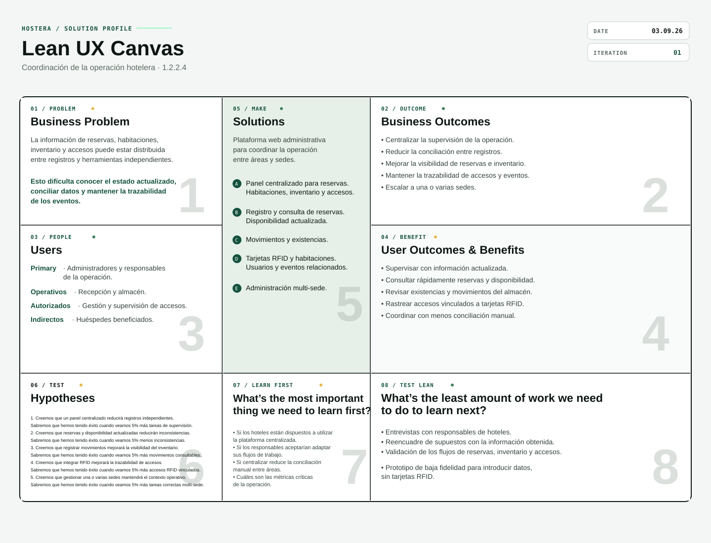

### UNIVERSIDAD PERUANA DE CIENCIAS APLICADAS

### Ingeniería de Software

### 202620

### Código: 1ASI0730

### Curso: Desarrollo de Aplicaciones Web - Presencial

### NRC: 8150

### Docente: Velasquez Nuñez Angel Augusto

### Informe de Trabajo Final

### Startup: Grafo Verde

### Producto: Hostera

### Integrantes

|       Apellidos y Nombres        | Código de Alumno |
| :------------------------------: | :--------------: |
|   Cuba Pareja, Joaquin Antonio   |    u201621281    |
|     Cuba Vega, Darnell Yadir     |    u202410105    |
| Condori Urviola, Mateo Sebastián |    U20231E443    |
|     Flores Rios, Juan Diego      |    U202412124    |
|    Santana Luna, José Antonio    |    U20241E281    |

## Setiembre - 2026

# Control de versiones

| Versión |   Fecha    | Autor(es)                                                                                         | Descripción de cambios                                                                                                                                                                  |
| :-----: | :--------: | :------------------------------------------------------------------------------------------------ | :-------------------------------------------------------------------------------------------------------------------------------------------------------------------------------------- |
|  0.1.1  | 03/09/2026 | Joaquin Cuba (`joacuba`)                                                                          | Se agregó la documentación del repositorio, el script para generar el PDF y la licencia MIT. Se corrigió el diseño de la portada, el tamaño de las imágenes y los bordes de las tablas. |
|  0.1.0  | 03/09/2026 | Joaquin Cuba (`joacuba`) Darnell Cuba (`darnell1910`) Juan Diego Flores Rios (`YopoFlores`) | Se creó la estructura inicial del informe del proyecto Hostera, se incorporaron los recursos gráficos y se agregó la descripción de la startup.                                         |

# Project Report Collaboration Insights

| Nombre y Apellidos               | Usuario de GitHub |
| -------------------------------- | ----------------- |
| Cuba Pareja, Joaquin Antonio     | `joacuba`         |
| Cuba Vega, Darnell Yadir         | `darnell1910`     |
| Condori Urviola, Mateo Sebastián | `BeyaminUv`       |
| Flores Rios, Juan Diego          | `YopoFlores`      |
| Santana Luna, José Antonio       | `JhosBY2005`      |

**Repositorio del proyecto:** [Ver repositorio en GitHub](https://github.com/1ASI0730-2620-8150-GrafoVerde/hostera-report)

## AV1

## TB1

## AV2

## TB2

# Contenido

## Tabla de Contenidos

- [Student Outcome](#student-outcome)

- [Capítulo I: Introducción](#capítulo-i-introducción)

- [1.1. Startup Profile](#11-startup-profile)
  - [1.1.1. Descripción de la Startup](#111-descripción-de-la-startup)
  - [1.1.2. Perfiles de integrantes del equipo](#112-perfiles-de-integrantes-del-equipo)
- [1.2. Solution Profile](#12-solution-profile)
  - [1.2.1. Antecedentes y problemática](#121-antecedentes-y-problemática)
    - [Técnica de The 5 'W's y 2 'H's](#técnica-de-the-5-ws-y-2-hs)
  - [1.2.2. Lean UX Process](#122-lean-ux-process)
    - [1.2.2.1. Lean UX Problem Statement](#1221-lean-ux-problem-statement)
    - [1.2.2.2. Lean UX Assumptions](#1222-lean-ux-assumptions)
    - [1.2.2.3. Lean UX Hypothesis Statements](#1223-lean-ux-hypothesis-statements)
    - [1.2.2.4. Lean UX Canvas](#1224-lean-ux-canvas)
- [1.3. Segmentos objetivo](#13-segmentos-objetivo)

- [Capítulo II: Requirements Elicitation & Analysis](#capítulo-ii-requirements-elicitation--analysis)

- [2.1. Competidores](#21-competidores)
  - [2.1.1. Análisis competitivo](#211-análisis-competitivo)
  - [2.1.2. Estrategias y tácticas frente a competidores](#212-estrategias-y-tácticas-frente-a-competidores)
- [2.2. Entrevistas](#22-entrevistas)
  - [2.2.1. Diseño de entrevistas](#221-diseño-de-entrevistas)
  - [2.2.2. Registro de entrevistas](#222-registro-de-entrevistas)
  - [2.2.3. Análisis de entrevistas](#223-análisis-de-entrevistas)
- [2.3. Needfinding](#23-needfinding)
  - [2.3.1. User Personas](#231-user-personas)
  - [2.3.2. User Task Matrix](#232-user-task-matrix)
  - [2.3.3. User Journey Mapping](#233-user-journey-mapping)
  - [2.3.4. Empathy Mapping](#234-empathy-mapping)
- [2.4. Big Picture EventStorming](#24-big-picture-eventstorming)
- [2.5. Ubiquitous Language](#25-ubiquitous-language)

- [Capítulo III: Requirements Specification](#capítulo-iii-requirements-specification)

- [3.1. User Stories](#31-user-stories)
- [3.2. Impact Mapping](#32-impact-mapping)
- [3.4. Product Backlog](#34-product-backlog)

- [Capítulo IV: Product Design](#capítulo-iv-product-design)

- [4.1. Style Guidelines](#41-style-guidelines)
  - [4.1.1. General Style Guidelines](#411-general-style-guidelines)
  - [4.1.2. Web Style Guidelines](#412-web-style-guidelines)
- [4.2. Information Architecture](#42-information-architecture)
  - [4.2.1. Organization Systems](#421-organization-systems)
  - [4.2.2. Labeling Systems](#422-labeling-systems)
  - [4.2.3. SEO Tags and Meta Tags](#423-seo-tags-and-meta-tags)
  - [4.2.4. Searching Systems](#424-searching-systems)
  - [4.2.5. Navigation Systems](#425-navigation-systems)
- [4.3. Landing Page UI Design](#43-landing-page-ui-design)
  - [4.3.1. Landing Page Wireframe](#431-landing-page-wireframe)
  - [4.3.2. Landing Page Mock-up](#432-landing-page-mock-up)
- [4.4. Web Applications UX/UI Design](#44-web-applications-uxui-design)
  - [4.4.1. Web Applications Wireframes](#441-web-applications-wireframes)
  - [4.4.2. Web Applications Wireflow Diagrams](#442-web-applications-wireflow-diagrams)
  - [4.4.3. Web Applications Mock-ups](#443-web-applications-mock-ups)
  - [4.4.4. Web Applications User Flow Diagrams](#444-web-applications-user-flow-diagrams)
- [4.5. Web Applications Prototyping](#45-web-applications-prototyping)
- [4.6. Domain-Driven Software Architecture](#46-domain-driven-software-architecture)
  - [4.6.1. Software Architecture Context Diagram](#461-software-architecture-context-diagram)
  - [4.6.2. Software Architecture Container Diagrams](#462-software-architecture-container-diagrams)
  - [4.6.3. Software Architecture Components Diagrams](#463-software-architecture-components-diagrams)
- [4.7. Software Object-Oriented Design](#47-software-object-oriented-design)
  - [4.7.1. Class Diagrams](#471-class-diagrams)
- [4.8. Database Design](#48-database-design)
  - [4.8.1. Database Diagrams](#481-database-diagrams)

- [Capítulo V: Product Implementation, Validation & Deployment](#capítulo-v-product-implementation-validation--deployment)

- [5.1. Software Configuration Management](#51-software-configuration-management)
  - [5.1.1. Software Development Environment Configuration](#511-software-development-environment-configuration)
  - [5.1.2. Source Code Management](#512-source-code-management)
  - [5.1.3. Source Code Style Guide & Conventions](#513-source-code-style-guide--conventions)
  - [5.1.4. Software Deployment Configuration](#514-software-deployment-configuration)
- [5.2. Landing Page, Services & Applications Implementation](#52-landing-page-services--applications-implementation)
  - [5.2.1. Sprint 1](#521-sprint-1)
    - [5.2.1.1. Sprint Planning 1](#5211-sprint-planning-1)
    - [5.2.1.2. Aspect Leaders and Collaborators](#5212-aspect-leaders-and-collaborators)
    - [5.2.1.3. Sprint Backlog 1](#5213-sprint-backlog-1)
    - [5.2.1.4. Development Evidence for Sprint Review](#5214-development-evidence-for-sprint-review)
    - [5.2.1.5. Execution Evidence for Sprint Review](#5215-execution-evidence-for-sprint-review)
    - [5.2.1.6. Services Documentation Evidence for Sprint Review](#5216-services-documentation-evidence-for-sprint-review)
    - [5.2.1.7. Software Deployment Evidence for Sprint Review](#5217-software-deployment-evidence-for-sprint-review)
    - [5.2.1.8. Team Collaboration Insights during Sprint](#5218-team-collaboration-insights-during-sprint)

- [Conclusiones](#conclusiones)
  - [Conclusiones y recomendaciones](#conclusiones-y-recomendaciones)
  - [Video About-the-Team](#video-about-the-team)

- [Bibliografía](#bibliografía)

- [Anexos](#anexos)

# Student Outcome

| Criterio específico                                                                             | Acciones realizadas                                                                                                                                                                                                                                                                                                                                                                                                                                                                                                                                                                                                                                                                      | Conclusiones                                                                                                                                                                                                                                                                                                                                                                                                                                                                                                                                                                                                                                                                             |
| ----------------------------------------------------------------------------------------------- | ---------------------------------------------------------------------------------------------------------------------------------------------------------------------------------------------------------------------------------------------------------------------------------------------------------------------------------------------------------------------------------------------------------------------------------------------------------------------------------------------------------------------------------------------------------------------------------------------------------------------------------------------------------------------------------------- | ---------------------------------------------------------------------------------------------------------------------------------------------------------------------------------------------------------------------------------------------------------------------------------------------------------------------------------------------------------------------------------------------------------------------------------------------------------------------------------------------------------------------------------------------------------------------------------------------------------------------------------------------------------------------------------------- |
| Trabaja en equipo para proporcionar liderazgo en forma conjunta                                 | **AV1** Cuba Pareja, Joaquin Antonio Cuba Vega, Darnell Yadir Condori Urviola, Mateo Sebastián Flores Rios, Juan Diego Santana Luna, José Antonio  **TB1** Cuba Pareja, Joaquin Antonio Cuba Vega, Darnell Yadir Condori Urviola, Mateo Sebastián Flores Rios, Juan Diego Santana Luna, José Antonio  **AV2** Cuba Pareja, Joaquin Antonio Cuba Vega, Darnell Yadir Condori Urviola, Mateo Sebastián Flores Rios, Juan Diego Santana Luna, José Antonio  **TB2** Cuba Pareja, Joaquin Antonio Cuba Vega, Darnell Yadir Condori Urviola, Mateo Sebastián Flores Rios, Juan Diego Santana Luna, José Antonio | **AV1** Cuba Pareja, Joaquin Antonio Cuba Vega, Darnell Yadir Condori Urviola, Mateo Sebastián Flores Rios, Juan Diego Santana Luna, José Antonio  **TB1** Cuba Pareja, Joaquin Antonio Cuba Vega, Darnell Yadir Condori Urviola, Mateo Sebastián Flores Rios, Juan Diego Santana Luna, José Antonio  **AV2** Cuba Pareja, Joaquin Antonio Cuba Vega, Darnell Yadir Condori Urviola, Mateo Sebastián Flores Rios, Juan Diego Santana Luna, José Antonio  **TB2** Cuba Pareja, Joaquin Antonio Cuba Vega, Darnell Yadir Condori Urviola, Mateo Sebastián Flores Rios, Juan Diego Santana Luna, José Antonio |
| Crea un entorno colaborativo e inclusivo, establece metas, planifica tareas y cumple objetivos. | **AV1** Cuba Pareja, Joaquin Antonio Cuba Vega, Darnell Yadir Condori Urviola, Mateo Sebastián Flores Rios, Juan Diego Santana Luna, José Antonio  **TB1** Cuba Pareja, Joaquin Antonio Cuba Vega, Darnell Yadir Condori Urviola, Mateo Sebastián Flores Rios, Juan Diego Santana Luna, José Antonio  **AV2** Cuba Pareja, Joaquin Antonio Cuba Vega, Darnell Yadir Condori Urviola, Mateo Sebastián Flores Rios, Juan Diego Santana Luna, José Antonio  **TB2** Cuba Pareja, Joaquin Antonio Cuba Vega, Darnell Yadir Condori Urviola, Mateo Sebastián Flores Rios, Juan Diego Santana Luna, José Antonio | **AV1** Cuba Pareja, Joaquin Antonio Cuba Vega, Darnell Yadir Condori Urviola, Mateo Sebastián Flores Rios, Juan Diego Santana Luna, José Antonio  **TB1** Cuba Pareja, Joaquin Antonio Cuba Vega, Darnell Yadir Condori Urviola, Mateo Sebastián Flores Rios, Juan Diego Santana Luna, José Antonio  **AV2** Cuba Pareja, Joaquin Antonio Cuba Vega, Darnell Yadir Condori Urviola, Mateo Sebastián Flores Rios, Juan Diego Santana Luna, José Antonio  **TB2** Cuba Pareja, Joaquin Antonio Cuba Vega, Darnell Yadir Condori Urviola, Mateo Sebastián Flores Rios, Juan Diego Santana Luna, José Antonio |

# Capítulo I: Introducción

## 1.1. Startup Profile

### 1.1.1. Descripción de la Startup

Grafo Verde es una startup tecnológica enfocada en desarrollar soluciones digitales innovadoras para la gestión y operación del sector hotelero. Nuestro propósito es ayudar a los hoteles a trabajar de manera más ordenada, segura y eficiente mediante herramientas accesibles, centralizadas y escalables que permitan supervisar la operación diaria y tomar decisiones basadas en información actualizada.

Nuestra solución es Hostera, una plataforma web administrativa que centraliza la gestión de reservas, la disponibilidad de habitaciones, el inventario del almacén y el control de accesos físicos. A través de un panel de monitoreo en tiempo real, Hostera permite visualizar el estado de la operación hotelera desde un solo lugar, reduciendo errores de sobreventa, mejorando la visibilidad del stock y facilitando el control de las habitaciones.

Hostera incorpora una solución de Internet de las Cosas (IoT) basada en tarjetas RFID y lectores RFID para gestionar el acceso de huéspedes y personal autorizado. Esta integración permite asociar tarjetas con habitaciones, validar los accesos y mantener un registro de las entradas, fortaleciendo la seguridad y proporcionando mayor control sobre los espacios del hotel.

La propuesta de Grafo Verde se centra en construir un ecosistema de gestión hotelera conectado, intuitivo y preparado para crecer. Hostera puede adaptarse a la operación de un hotel individual y replicarse en distintas sedes de una cadena, manteniendo la información organizada y ofreciendo una visión consolidada de reservas, habitaciones, inventario y accesos.

**Misión:** Desarrollar herramientas digitales accesibles, seguras y eficientes que permitan a los hoteles gestionar sus reservas, habitaciones, inventario y accesos en tiempo real, mejorando la operación diaria y la experiencia de sus equipos y huéspedes.

**Visión:** En los próximos cinco años, consolidar a Grafo Verde como una empresa referente en soluciones de gestión hotelera en Latinoamérica, reconocida por conectar la operación de los hoteles mediante tecnología innovadora, escalable y orientada a la eficiencia y la seguridad.

**Alcance del proyecto:** El alcance inicial de Hostera comprende una plataforma web administrativa para centralizar el monitoreo de reservas, disponibilidad de habitaciones, inventario del almacén y accesos físicos mediante tarjetas y lectores RFID. La solución está diseñada para ofrecer visibilidad en tiempo real, reducir inconsistencias operativas y facilitar la administración de una o varias sedes desde un único panel. A mediano plazo, buscamos ampliar sus capacidades de automatización, análisis y control para acompañar el crecimiento de hoteles y cadenas hoteleras en Latinoamérica.

### 1.1.2. Perfiles de integrantes del equipo

| Foto                                                                                                              | Apellidos y Nombres              | Código     | Carrera                | Habilidades                                                                                                                                                                           |
| ----------------------------------------------------------------------------------------------------------------- | -------------------------------- | ---------- | ---------------------- | ------------------------------------------------------------------------------------------------------------------------------------------------------------------------------------- |
|  | Cuba Pareja, Joaquin Antonio     | u201621281 | Ingeniería de Software | JavaScript, TypeScript, Python, HTML, CSS y C++. Dispuesto a trabajar y aprender en equipo. Tiene facilidad para aprender rápidamente nuevas tecnologías y lenguajes de programación. |
|    | Cuba Vega, Darnell Yadir         | u202410105 | Ingeniería de Software |                                                                                                                                                                                       |
|  | Condori Urviola, Mateo Sebastián | U20231E443 | Ingeniería de Software |                                                                                                                                                                                       |
|       | Flores Rios, Juan Diego          | U202412124 | Ingeniería de Software |                                                                                                                                                                                       |
|  | Santana Luna, José Antonio       | U20241E281 | Ingeniería de Software |                                                                                                                                                                                       |

## 1.2. Solution Profile

### 1.2.1. Antecedentes y problemática

Esta sección presenta una aproximación preliminar a la problemática que Hostera busca
atender. El análisis se organizó mediante la técnica 5W+2H, una herramienta para
describir un problema y concentrarse en sus causas antes de plantear una solución
[1]. Los hallazgos descritos deberán complementarse y validarse posteriormente con
entrevistas y otras actividades de needfinding.

#### Técnica de The 5 'W's y 2 'H's

**What (¿Qué?)**

**¿Cuál es el problema?**

Los hoteles necesitan coordinar varias actividades para atender a sus huéspedes y
mantener la operación diaria: gestionar reservas, conocer la disponibilidad de las
habitaciones, controlar las existencias del almacén y administrar los accesos a los
espacios físicos. En la aproximación actual del proyecto, estas actividades pueden
apoyarse en registros, archivos o herramientas independientes, lo que dificulta
obtener una visión única y actualizada del estado del hotel.

Cuando la información de una reserva, una habitación, un producto del almacén o un
acceso no se encuentra sincronizada, el personal puede trabajar con datos distintos
según el área que consulte. Esto puede provocar duplicidad de registros,
inconsistencias entre la reserva y la disponibilidad real, demoras en la atención y
dificultades para rastrear quién ingresó a una habitación. La problemática descrita
es preliminar y deberá contrastarse con usuarios del sector hotelero.

**When (¿Cuándo?)**

**¿Cuándo se presenta el problema?**

La problemática puede presentarse durante toda la operación diaria del hotel, pero
se vuelve especialmente relevante cuando se registra una nueva reserva, se modifica
una reserva existente o se actualiza el estado de una habitación. También puede
aparecer durante el check-in y el check-out, cuando recepción necesita confirmar
rápidamente la disponibilidad y autorizar o revocar accesos.

Del mismo modo, el problema puede manifestarse cuando se reciben o consumen
productos del almacén y cuando se requiere revisar el historial de accesos. En esos
momentos, la falta de información compartida puede obligar al personal a consultar
varios registros y conciliarlos manualmente antes de tomar una decisión.

**Where (¿Dónde?)**

**¿En qué lugares o procesos se presenta?**

El problema se ubica principalmente en los procesos administrativos y operativos del
hotel. Comprende la recepción, donde se registran las reservas y se atiende a los
huéspedes; la gestión de habitaciones, donde se consulta su disponibilidad; el
almacén, donde se controla el inventario; y los puntos de acceso donde se validan
las tarjetas RFID.

La dificultad también puede aumentar cuando el negocio administra más de una sede,
porque la información debe consolidarse y mantenerse consistente entre diferentes
hoteles. Por esa razón, el análisis considera tanto la operación de un hotel
individual como la coordinación básica de varias sedes desde un mismo entorno.

**Who (¿Quién?)**

**¿A quiénes afecta el problema?**

Los usuarios potenciales directamente relacionados con el problema son los
administradores y responsables de la operación hotelera, el personal de recepción,
los encargados del almacén y el personal autorizado que gestiona o supervisa los
accesos. Cada perfil necesita consultar o actualizar una parte diferente de la
operación, por lo que la ausencia de una fuente común de información puede generar
trabajo duplicado y dificultades de coordinación.

Los huéspedes pueden verse afectados indirectamente cuando existen inconsistencias
en la disponibilidad de las habitaciones, demoras durante la atención o problemas
para acceder a un espacio autorizado. Estos perfiles son una identificación inicial
del dominio; la segmentación definitiva y las necesidades de cada usuario deberán
validarse mediante entrevistas y actividades de needfinding.

**Why (¿Por qué?)**

**¿Por qué se presenta el problema?**

La causa preliminar es la ausencia de una gestión centralizada que relacione los
datos de reservas, habitaciones, inventario y accesos. Cuando cada proceso se
registra o consulta de manera independiente, las actualizaciones pueden no estar
disponibles para todas las personas que las necesitan y se reduce la trazabilidad de
los cambios.

Esta situación puede producir duplicidad de información, diferencias entre el
estado registrado y el estado real de una habitación, menor visibilidad de las
existencias y dificultades para revisar los accesos realizados. Como resultado, el
personal cuenta con menos información para actuar oportunamente y debe invertir
tiempo en verificar o conciliar datos antes de completar sus tareas.

**How (¿Cómo?)**

**¿Cómo se manifiesta y se diferencia del estado esperado?**

En un estado operativo esperado, una modificación de reserva debería reflejarse en
la disponibilidad de la habitación y estar disponible para las personas responsables
de la atención. De forma similar, el consumo o ingreso de productos debería
actualizar la información del inventario, y un acceso autorizado debería poder
relacionarse con una tarjeta, una habitación y un usuario o huésped.

En la situación problemática, estos cambios pueden quedar distribuidos en procesos
independientes. El personal debe buscar información en diferentes registros, comparar
datos y comunicar manualmente las actualizaciones. La ausencia de un panel común y
de una relación clara entre habitaciones y accesos RFID dificulta distinguir con
rapidez el estado actual de la operación y seguir el historial de los eventos.

**How Much (¿Cuánto?)**

**¿Cuánto costará implementar la solución?**

Actualmente no se cuenta con métricas operativas validadas sobre la frecuencia de
los incidentes, el tiempo dedicado a conciliar información o las pérdidas económicas
asociadas. Para dimensionar inicialmente el esfuerzo, se plantea el siguiente
presupuesto referencial para desarrollar un producto mínimo viable de software. Los
montos son una estimación de planificación y deberán ajustarse después de definir
los requisitos, la arquitectura y las integraciones necesarias.

**Presupuesto estimado de software:**

| Componente                                                                |            Costo estimado |
| ------------------------------------------------------------------------- | ------------------------: |
| Diseño UX/UI y prototipo del dashboard web                                |       S/ 2,500 – S/ 4,000 |
| Desarrollo frontend del dashboard administrativo                          |       S/ 4,000 – S/ 6,000 |
| Backend, API y base de datos                                              |       S/ 4,000 – S/ 6,500 |
| Integración del software de control de accesos RFID y registro de eventos |       S/ 2,500 – S/ 4,000 |
| Pruebas, documentación y configuración del despliegue                     |       S/ 1,500 – S/ 2,500 |
| Dominio, hosting y servicios de infraestructura (anual)                   |       S/ 1,200 – S/ 2,000 |
| **Total estimado de software**                                            | **S/ 15,700 – S/ 25,000** |

Esta estimación no incluye la compra de tarjetas, lectores RFID u otro hardware
físico, ni costos de operación del hotel. Tampoco representa una cotización
comercial; su finalidad es mostrar una primera aproximación del costo de software y
dejar identificados los elementos que deberán precisarse durante las siguientes
etapas del proyecto.

Los aspectos principales que la solución propuesta debe resolver son los siguientes:

1. **Centralización de la información:** reunir en un único panel la información de reservas, disponibilidad de habitaciones, inventario y accesos.
2. **Visibilidad operativa:** facilitar la consulta del estado actualizado de la operación para que el personal pueda identificar inconsistencias y actuar oportunamente.
3. **Coordinación entre procesos:** relacionar la asignación de habitaciones con la autorización y el registro de accesos mediante tarjetas y lectores RFID.
4. **Control del inventario:** permitir una supervisión más ordenada de las existencias del almacén y de sus cambios.
5. **Escalabilidad operativa:** permitir que la información de un hotel individual o de varias sedes pueda administrarse desde una plataforma común.

**Objetivo general.** Proponer y validar una plataforma web administrativa que centralice la
gestión de reservas, disponibilidad de habitaciones, inventario y accesos físicos, con el
fin de mejorar la visibilidad y la coordinación de la operación hotelera.

**Objetivos específicos.**

- Organizar en un solo espacio la información relevante para la supervisión diaria del hotel.
- Facilitar el seguimiento de reservas y disponibilidad para reducir inconsistencias operativas y riesgos de sobreventa.
- Integrar el control de accesos mediante tarjetas y lectores RFID, manteniendo un registro de las entradas autorizadas.
- Proporcionar una base que pueda adaptarse a la administración de una o varias sedes.
- Validar posteriormente, con usuarios representativos, si la solución responde a los problemas y necesidades identificados.

**Restricciones y delimitación.**

- El alcance inicial se limita a una plataforma web administrativa para monitorear reservas, habitaciones, inventario y accesos; no contempla reemplazar todos los sistemas comerciales o contables que un hotel pueda utilizar.
- El control físico de accesos depende de la disponibilidad y configuración de tarjetas y lectores RFID compatibles.
- La plataforma debe manejar la información de forma centralizada, pero la definición de reglas detalladas para cada hotel o sede deberá establecerse durante el levantamiento de requisitos.
- No se presentan todavía cifras sobre frecuencia, costos o reducción de incidentes; cualquier beneficio cuantitativo deberá demostrarse mediante validaciones posteriores.

### 1.2.2. Lean UX Process

#### 1.2.2.1. Lean UX Problem Statement

**Enunciado del problema**

Nuestro servicio ofrece una plataforma web administrativa para la gestión y operación
hotelera. Hostera busca ayudar a los administradores y responsables de la operación a
coordinar reservas, disponibilidad de habitaciones, inventario y accesos físicos desde
una visión común. El personal de recepción, los encargados del almacén y el personal
autorizado también participan en estos procesos, mientras que los huéspedes se
benefician indirectamente de una atención más coordinada y oportuna.

Hemos observado un factor crítico que afecta la coordinación de la operación
hotelera: la información necesaria para estos procesos puede encontrarse distribuida
entre diferentes registros o herramientas independientes. Esta situación puede
dificultar que los responsables y usuarios operativos conozcan el estado actualizado
de una reserva o habitación, controlen las existencias del almacén y relacionen los
accesos autorizados con una habitación y un usuario. También puede obligarlos a
comparar y conciliar datos manualmente, generando riesgos de duplicidad, demoras en la
atención y menor trazabilidad, especialmente cuando se coordinan varias sedes. Esta
observación es preliminar y deberá validarse con usuarios del sector hotelero.

¿Cómo podríamos mejorar la coordinación de la operación hotelera para que sus
responsables y usuarios operativos trabajen con información actualizada, reduzcan la
conciliación manual, mantengan la trazabilidad de los eventos y tomen decisiones
oportunas?

**Domain:** Gestión y operación hotelera, incluyendo reservas, disponibilidad de
habitaciones, control de inventario y gestión de accesos físicos.

**Customer Segments:**

- Administradores y responsables de la operación hotelera.
- Personal de recepción.
- Encargados del almacén.
- Personal autorizado que gestiona o supervisa accesos.
- Huéspedes como beneficiarios indirectos de una operación coordinada.

**Pain Points:**

- Dificultad para consultar en un mismo contexto la información de reservas,
  habitaciones, inventario y accesos.
- Riesgo de trabajar con datos diferentes entre áreas o registros independientes.
- Tiempo adicional dedicado a verificar y conciliar información antes de completar
  tareas operativas.
- Poca trazabilidad para relacionar los accesos autorizados con una habitación y un
  usuario o huésped.
- Mayor dificultad para mantener una visión consistente cuando se coordinan varias
  sedes.

**Gap:** Los registros y herramientas utilizados en los procesos hoteleros no
resuelven de manera integrada la necesidad de contar con información centralizada,
actualizada y relacionada entre reservas, habitaciones, inventario y accesos. Esta
brecha limita la visibilidad de los responsables de la operación y la coordinación
entre los usuarios que participan en las tareas diarias.

**Vision/Strategy:** Hostera buscará cerrar esta brecha mediante una solución digital
administrativa orientada a centralizar la información operativa, facilitar su consulta
y apoyar la coordinación entre áreas. La estrategia inicial considera la gestión de
reservas y habitaciones, el seguimiento del inventario y la relación de los accesos
físicos con tarjetas y lectores RFID. Esta dirección deberá evolucionar según la
evidencia obtenida durante el descubrimiento y la validación.

**Initial Segment:** El foco inicial serán los **administradores y responsables de la
operación hotelera**, debido a que necesitan una visión consolidada para supervisar
los procesos y tomar decisiones. Los demás perfiles se considerarán usuarios
operativos relacionados o beneficiarios indirectos. Esta priorización es preliminar y
deberá confirmarse con evidencia de usuarios.

**Success Criteria:** Se considerará que la iniciativa avanza hacia el éxito cuando
los usuarios puedan completar tareas representativas con información centralizada,
actualizada y sin depender de la conciliación entre registros independientes. Para
medir ese comportamiento se proponen los siguientes indicadores, cuyos valores
iniciales y metas se definirán durante la validación:

- porcentaje de tareas de consulta o actualización de reservas y disponibilidad que
  se completan desde el entorno administrativo;
- tiempo promedio que necesita el personal para encontrar el estado actual de una
  reserva o habitación;
- porcentaje de movimientos de inventario registrados y consultables en la solución;
- porcentaje de accesos autorizados relacionados con una tarjeta RFID, una habitación
  y un usuario o huésped; y
- número de inconsistencias detectadas durante escenarios de prueba.

#### 1.2.2.2. Lean UX Assumptions

Los siguientes supuestos representan las creencias iniciales del equipo sobre el
negocio, los usuarios, los resultados esperados y las capacidades que podría ofrecer
Hostera. Se formulan como afirmaciones que deberán ser contrastadas mediante
entrevistas, prototipos y experimentos durante las siguientes iteraciones del proceso
Lean UX.

**Business Assumptions**

1. Creemos que los hoteles que administran sus reservas, habitaciones, inventario y
   accesos con procesos separados necesitan una visión operativa más centralizada.
2. Creemos que una plataforma web administrativa enfocada en la coordinación de estos
   procesos puede ofrecer valor a hoteles individuales y a negocios que administran
   varias sedes.
3. Creemos que el principal valor de Hostera para el negocio será facilitar la
   supervisión diaria y mejorar la consistencia de la información operativa.
4. Creemos que un modelo de suscripción por hotel o por sede podría ser una
   alternativa viable para comercializar Hostera, aunque esta posibilidad todavía no
   ha sido validada con clientes.
5. Creemos que Grafo Verde puede organizar sus capacidades de diseño y desarrollo
   para construir y validar un producto mínimo viable dentro del alcance académico
   definido para Hostera.

**Business Outcome Assumptions**

1. Creemos que los responsables de la operación consultarán el entorno administrativo
   como una fuente principal para supervisar reservas, habitaciones, inventario y
   accesos.
2. Creemos que la centralización de la información reducirá la necesidad de comparar
   registros independientes antes de tomar decisiones operativas.
3. Creemos que el personal podrá identificar con mayor rapidez el estado de una
   reserva o habitación cuando la información se encuentre disponible en un mismo
   entorno.
4. Creemos que una mayor trazabilidad de los accesos y movimientos de inventario
   permitirá a los responsables detectar inconsistencias con mayor oportunidad.
5. Creemos que estos cambios de comportamiento contribuirán a que Hostera genere
   valor para los hoteles, aunque las métricas y metas concretas deberán definirse
   después de establecer una línea base.

**User Assumptions**

1. **¿Quién es el usuario?** Creemos que los usuarios principales serán los
   administradores y responsables de la operación hotelera. También interactuarán con
   la solución el personal de recepción, los encargados del almacén y el personal
   autorizado que gestiona o supervisa los accesos. Los huéspedes serán beneficiarios
   indirectos y no constituirán el usuario administrativo principal del MVP.
2. **¿Dónde encaja nuestro producto en su trabajo o vida?** Creemos que Hostera
   encajará en las actividades diarias de administración y operación del hotel como
   un entorno común para consultar y actualizar información de reservas, habitaciones,
   inventario y accesos. Los responsables lo utilizarán para supervisar la operación,
   mientras que el personal operativo lo empleará como apoyo en sus tareas específicas.
3. **¿Qué problemas debe resolver nuestro producto?** Creemos que Hostera debe
   ayudar a resolver la dispersión de información entre registros independientes, las
   inconsistencias entre reservas y disponibilidad, la poca visibilidad del inventario,
   la dificultad para rastrear accesos autorizados y la coordinación de información
   entre varias sedes.
4. **¿Cuándo y cómo se usará nuestro producto?** Creemos que Hostera se utilizará
   durante el registro o modificación de reservas, la actualización de la
   disponibilidad, los procesos de check-in y check-out, el registro de movimientos
   del almacén, la autorización de accesos y la revisión del historial de eventos. El
   uso se realizará desde la plataforma web, según las responsabilidades de cada
   usuario y las necesidades de la operación.
5. **¿Qué características son importantes?** Creemos que serán importantes la
   centralización de reservas y disponibilidad, el registro y consulta del inventario,
   la relación de tarjetas y lectores RFID con habitaciones y usuarios, la trazabilidad
   de los accesos y la posibilidad de consultar información de una o varias sedes.
6. **¿Cómo debe verse y comportarse nuestro producto?** Creemos que Hostera debe
   presentar una interfaz clara, ordenada y fácil de comprender para usuarios con
   diferentes responsabilidades. La solución debe mostrar información actualizada,
   mantener una navegación consistente, brindar confirmación de las acciones
   realizadas y facilitar la identificación de estados, cambios e incidencias sin
   exigir que el usuario consulte múltiples registros.

**User Outcome and Benefit Assumptions**

1. Creemos que los responsables de la operación desean contar con información
   actualizada para tomar decisiones sin depender de múltiples registros.
2. Creemos que el personal de recepción se beneficiará de consultar rápidamente la
   disponibilidad de las habitaciones y el estado de las reservas.
3. Creemos que los encargados del almacén se beneficiarán de disponer de un historial
   organizado de los ingresos, consumos y existencias.
4. Creemos que el personal autorizado y los responsables del hotel valorarán poder
   revisar la trazabilidad de los accesos vinculados con tarjetas RFID.
5. Creemos que los usuarios operativos considerarán valiosa una experiencia que
   reduzca la conciliación manual y les permita coordinar tareas entre áreas o sedes.

**Feature Assumptions**

1. Creemos que un panel administrativo que centralice reservas, habitaciones,
   inventario y accesos ayudará a los usuarios a supervisar la operación desde un
   mismo entorno.
2. Creemos que las funciones para registrar y consultar reservas y disponibilidad
   permitirán reducir inconsistencias entre la información reservada y el estado de
   las habitaciones.
3. Creemos que el registro de movimientos de inventario permitirá mejorar la
   visibilidad de las existencias y facilitar su seguimiento.
4. Creemos que la integración con tarjetas y lectores RFID permitirá asociar accesos
   autorizados con habitaciones y usuarios, además de conservar un historial de
   eventos.
5. Creemos que una estructura de información preparada para una o varias sedes
   permitirá que Hostera crezca junto con las necesidades de sus clientes.

Estos supuestos no representan requisitos definitivos ni resultados comprobados. Los
supuestos más riesgosos deberán priorizarse para formular los Hypothesis Statements y
definir los experimentos que permitan confirmarlos o modificarlos.

#### 1.2.2.3. Lean UX Hypothesis Statements

Los Hypothesis Statements representan una evolución de los Assumptions, ya que
convierten las creencias iniciales del equipo en afirmaciones que pueden medirse y
comprobarse. Cada hipótesis aplica el formato de Lean UX y relaciona un business
outcome con un user outcome y una feature específica. Esta estructura permite
contrastar las ideas con evidencia y comprobar si Hostera contribuye tanto a los
objetivos del negocio como a las necesidades reales de sus usuarios.

**Hipótesis 1: Panel administrativo centralizado**

Creemos que centralizar la información de reservas, habitaciones, inventario y
accesos en un panel administrativo reducirá la dependencia de registros
independientes para supervisar la operación hotelera.

**Sabremos que hemos tenido éxito cuando veamos** un aumento de al menos 5% en las
tareas de supervisión que los administradores y responsables de la operación
completan desde el panel sin consultar registros adicionales, respecto a la línea
base definida durante la validación.

**Hipótesis 2: Gestión de reservas y disponibilidad**

Creemos que ofrecer al personal de recepción y a los administradores información
actualizada para registrar y consultar reservas y disponibilidad reducirá las
inconsistencias entre las reservas registradas y el estado de las habitaciones.

**Sabremos que hemos tenido éxito cuando veamos** una reducción de al menos 5% en
las inconsistencias detectadas entre reservas y disponibilidad, y una disminución del
tiempo necesario para encontrar el estado de una reserva o habitación, en comparación
con la línea base de la validación.

**Hipótesis 3: Registro y consulta del inventario**

Creemos que registrar y consultar los movimientos de inventario permitirá a los
encargados del almacén y a los responsables de la operación mejorar la visibilidad y
el seguimiento de las existencias.

**Sabremos que hemos tenido éxito cuando veamos** un aumento de al menos 5% en los
movimientos de inventario registrados y consultables, junto con una reducción de las
diferencias encontradas durante las pruebas de control de existencias, respecto a la
línea base.

**Hipótesis 4: Control y trazabilidad de accesos RFID**

Creemos que integrar las tarjetas y lectores RFID con el registro de eventos de
Hostera permitirá al personal autorizado y a los responsables de la operación mejorar
la trazabilidad de los accesos a las habitaciones y espacios del hotel.

**Sabremos que hemos tenido éxito cuando veamos** un aumento de al menos 5% en los
accesos autorizados que quedan relacionados con una tarjeta RFID, una habitación y un
usuario o huésped, además de una reducción del tiempo necesario para consultar su
historial.

**Hipótesis 5: Administración de una o varias sedes**

Creemos que una estructura de información preparada para administrar una o varias
sedes permitirá a los administradores y responsables de la operación mantener una
visión consistente sin perder el contexto de cada hotel.

**Sabremos que hemos tenido éxito cuando veamos** un aumento de al menos 5% en las
tareas de consulta y supervisión completadas correctamente en escenarios de una y
varias sedes, sin duplicar ni confundir la información operativa.

#### 1.2.2.4. Lean UX Canvas

## 1.3. Segmentos objetivo

Hostera está orientada a organizaciones del sector hotelero que necesitan coordinar
reservas, disponibilidad de habitaciones, inventario y accesos desde una plataforma
administrativa común. La segmentación considera el tipo de operación del hotel y el
rol de las personas responsables de tomar decisiones o supervisar estos procesos.
Debido a que se trata de una solución B2B, se consideran tanto características del
perfil de las personas como características empresariales del establecimiento, tales
como el número de sedes, el nivel de responsabilidad y la complejidad operativa.

Como contexto del mercado peruano, el Ministerio de Comercio Exterior y Turismo
(MINCETUR) reportó para 2024 una oferta promedio de 28 050 establecimientos de
hospedaje, 329 340 habitaciones y 567 292 plazas-cama. El 85,1 % de los
establecimientos no estaba categorizado y el 14,9 % estaba categorizado. Durante el
mismo año se registraron 57,6 millones de arribos, de los cuales el 88,4 % correspondió
a visitantes nacionales [4]. Estas cifras muestran la amplitud y diversidad del
sector, pero no clasifican directamente los establecimientos según propiedad
independiente o pertenencia a una cadena.

### 1.3.1. Administradores y propietarios de hoteles independientes

Este segmento está conformado por personas propietarias o administradoras que toman
decisiones y supervisan directamente la operación de un hotel independiente de una
sola sede. En este contexto, pueden participar en la gestión de reservas, la consulta
de disponibilidad, el control del almacén y la autorización o revisión de accesos.
Su necesidad principal es disponer de una visión consolidada de la operación sin
depender de registros separados o de conciliaciones manuales entre áreas.

Entre sus características relevantes se encuentran las siguientes:

- Responsabilidad directa sobre la continuidad y organización de la operación diaria.
- Gestión de un establecimiento ubicado en una única sede.
- Participación en decisiones administrativas y en la supervisión de varias áreas
  operativas.
- Necesidad de consultar información actualizada sin requerir sistemas independientes
  para cada proceso.

La importancia de este segmento se relaciona con la composición de la oferta peruana:
MINCETUR registró que el 85,1 % de los establecimientos de hospedaje no estaba
categorizado en 2024 [4]. Este indicador describe la estructura de categorización del
sector y no demuestra por sí solo que todos esos establecimientos sean independientes;
por ello, la relación entre esta característica y el tipo de propiedad deberá
validarse mediante entrevistas con administradores y propietarios en el mercado
peruano.

### 1.3.2. Gerentes o responsables de operaciones de pequeñas cadenas hoteleras

Este segmento está conformado por personas que supervisan la operación de una cadena
hotelera pequeña con dos o más sedes. Su responsabilidad consiste en coordinar y
comparar información de reservas, disponibilidad, inventario y accesos entre los
establecimientos, manteniendo la visibilidad de cada sede y una visión consolidada
del negocio.

Entre sus características relevantes se encuentran las siguientes:

- Responsabilidad sobre la coordinación operativa de varias sedes.
- Necesidad de comparar indicadores y estados sin mezclar la información de cada
  establecimiento.
- Supervisión de procesos que pueden ser ejecutados por equipos diferentes en cada
  sede.
- Interés en una plataforma que pueda crecer junto con la incorporación de nuevos
  establecimientos.

Este segmento se relaciona con la concentración geográfica de la oferta hotelera
peruana. En 2024, Lima concentró el 27,6 % de los establecimientos de hospedaje,
seguida por Cusco (8,1 %), Arequipa (5,9 %), Junín (5,7 %) y La Libertad (4,6 %); estas
cinco regiones reunieron el 52,0 % de la oferta nacional [4]. La concentración no
confirma por sí misma la existencia de cadenas pequeñas, pero evidencia un contexto
en el que la coordinación entre sedes puede ser relevante y deberá validarse con
gerentes o responsables de operaciones del sector hotelero peruano.

Los perfiles de recepción, almacén y control de accesos se consideran usuarios
operativos relacionados con estos dos segmentos. Los huéspedes son beneficiarios
indirectos de una operación más coordinada y no constituyen el usuario administrativo
principal del producto mínimo viable.

# Capítulo II: Requirements Elicitation & Analysis

## 2.1. Competidores

En esta sección se identifican y describen tres competidores directos de Hostera en
el mercado peruano. La selección considera proveedores que ofrecen productos
digitales para la gestión de establecimientos de hospedaje y que cubren, total o
parcialmente, los procesos que Hostera busca centralizar: reservas, disponibilidad de
habitaciones, inventario y supervisión de la operación. La información se basa en la
oferta pública de cada proveedor; por ello, la selección no pretende establecer un
ranking de participación de mercado.

**Nexus PMS de HotelClick.**

Nexus PMS es una plataforma web en la nube orientada a hoteles en Perú. Su propuesta
incluye la gestión de reservas, check-in y check-out, la sincronización con canales
como Booking.com, Airbnb, Expedia y Agoda, y la facturación electrónica integrada con
SUNAT. También ofrece control de inventarios con registro de entradas y salidas,
alertas de stock mínimo, usuarios con permisos y acceso desde computadoras y
dispositivos móviles [5].

El proveedor ofrece una demostración inicial y contratación mediante un pago anual
que incluye los módulos, las actualizaciones y el soporte técnico. La plataforma
integra facturación, POS y distribución por OTAs, de acuerdo con la información
pública del proveedor [5].

**OkFac.**

OkFac se presenta como un PMS hecho para hoteles peruanos. Incluye un calendario de
reservas, vista del estado de las habitaciones, check-in y check-out, housekeeping,
conexión con OTAs y emisión de comprobantes electrónicos mediante SUNAT [6]. En su
plan Pro incorpora inventario, compras y gastos; el plan Enterprise añade reportes y
operación multi-sucursal, además de roles y permisos avanzados [6]. Estas funciones
se ofrecen para hoteles y hostales de distintos tamaños.

Su modelo comercial es de suscripción mensual o anual por planes. El proveedor
publica planes para hoteles y hostales pequeños, medianos y grandes, desde S/ 140 al
mes, con implementación y capacitación incluidas; el plan Enterprise contempla
funciones multi-sucursal [6]. También ofrece facturación electrónica y módulos de
restaurante dentro de la misma cuenta [6].

**SysHotel.**

SysHotel es una plataforma PMS y ERP desarrollada para el mercado peruano, dirigida
desde hostales pequeños hasta cadenas con varias sedes. Su oferta pública incluye
reservas, check-in y check-out, disponibilidad de habitaciones, housekeeping,
facturación electrónica SUNAT, channel manager y un ERP con inventario
multi-almacén y kardex [7]. Además, el proveedor declara que puede cotizar
integraciones con cerraduras inteligentes y sistemas de control de acceso, aunque no
especifica que estas integraciones utilicen RFID [7].

El servicio se comercializa como suscripción con precios publicados desde S/ 100 al
mes, demostración guiada e integraciones personalizadas según el alcance. SysHotel
declara tener más de 150 hoteles activos en Perú [7].

### 2.1.1. Análisis competitivo

El objetivo del análisis es responder: **¿cómo se posiciona Hostera frente a las
soluciones digitales que ya pueden utilizar los hoteles peruanos para administrar su
operación?** La siguiente tabla compara el perfil, el valor ofrecido, el mercado,
las acciones de marketing, el producto, el modelo de precios, los canales y el
análisis SWOT de Hostera y de los tres competidores seleccionados.

<table class="competitive-landscape">
<tr><th colspan="6">Competitive Analysis Landscape</th></tr>
<tr>
  <td colspan="2"><strong>¿Por qué llevar a cabo este análisis?</strong></td>
  <td colspan="4">Comparar las alternativas digitales disponibles para la operación hotelera peruana y definir una posible ventaja competitiva para Hostera.</td>
</tr>
<tr>
  <th colspan="2">(En la cabecera colocar por cada competidor nombre y logo)</th>
  <th>Su startup <strong>Hostera</strong></th>
  <th>Competidor 1 <strong>Nexus PMS</strong> HotelClick [5]</th>
  <th>Competidor 2 <strong>OkFac</strong> [6]</th>
  <th>Competidor 3 <strong>SysHotel</strong> [7]</th>
</tr>
<tr>
  <td class="group-label" rowspan="2">Perfil</td>
  <td>Overview</td>
  <td>Plataforma web administrativa en desarrollo para reservas, disponibilidad, inventario y accesos RFID.</td>
  <td>PMS web en la nube para reservas, habitaciones, inventario, facturación y OTAs en Perú.</td>
  <td>PMS para hoteles y hostales peruanos con recepción, reservas, housekeeping y facturación electrónica.</td>
  <td>PMS + ERP desarrollado en Perú para recepción, housekeeping, inventario y back-office.</td>
</tr>
<tr>
  <td>Ventaja competitiva ¿Qué valor ofrece a los clientes?</td>
  <td>Integra reservas, habitaciones, almacén y accesos RFID en un mismo panel para una o varias sedes.</td>
  <td>Integra facturación SUNAT, POS, channel manager, acceso remoto y alertas de stock mínimo.</td>
  <td>Combina operación hotelera, cumplimiento SUNAT, implementación incluida y planes multi-sucursal.</td>
  <td>Combina PMS y ERP con inventario multi-almacén, kardex e integraciones de cerraduras y control de acceso.</td>
</tr>
<tr>
  <td class="group-label" rowspan="2">Perfil de Marketing</td>
  <td>Mercado objetivo</td>
  <td>Administradores y propietarios de hoteles independientes; gerentes o responsables de pequeñas cadenas.</td>
  <td>Hoteles que operan en Perú; no limita públicamente el servicio a un tamaño específico.</td>
  <td>Hoteles y hostales pequeños, hoteles medianos y establecimientos grandes con necesidades multi-sucursal.</td>
  <td>Hostales pequeños, hoteles medianos y hoteles grandes o cadenas con varias sedes.</td>
</tr>
<tr>
  <td>Estrategias de marketing</td>
  <td>La estrategia comercial se encuentra por validar durante el desarrollo y el levantamiento de requisitos.</td>
  <td>Demo gratuita, cobertura nacional, testimonios de clientes y promoción de una solución 100 % web.</td>
  <td>Demo gratuita, contacto por WhatsApp, planes publicados e implementación y capacitación incluidas.</td>
  <td>Demo guiada, precios de entrada publicados, contenidos comparativos e integraciones a medida.</td>
</tr>
<tr>
  <td class="group-label" rowspan="3">Perfil de Producto</td>
  <td>Productos &amp; Servicios</td>
  <td>Panel administrativo, reservas, disponibilidad, inventario, registro de eventos y control RFID.</td>
  <td>PMS, channel manager, reservas, check-in/out, inventarios, POS, SUNAT, usuarios y permisos.</td>
  <td>PMS, calendario, habitaciones, check-in/out, housekeeping, OTAs, inventario, compras, reportes y SUNAT.</td>
  <td>PMS, ERP, reservas, disponibilidad, housekeeping, channel manager, SUNAT, multi-almacén, kardex e integraciones.</td>
</tr>
<tr>
  <td>Precios &amp; Costos</td>
  <td>No definidos; se determinarán después de validar necesidades, alcance e implementación.</td>
  <td>Pago anual; el precio no se publica en la página consultada y se solicita una demostración.</td>
  <td>Planes de S/ 140, S/ 210 y S/ 350 mensuales; descuento anual e implementación incluida.</td>
  <td>Suscripción desde S/ 100 mensuales; integraciones específicas cotizadas según alcance.</td>
</tr>
<tr>
  <td>Canales de distribución (Web y/o Móvil)</td>
  <td>Plataforma web administrativa y lectores RFID instalados en los puntos de acceso.</td>
  <td>Aplicación web en la nube para PC, laptop, tableta o celular; demo en línea.</td>
  <td>Servicio web, demo y atención comercial por WhatsApp.</td>
  <td>Acceso desde computadora, tableta o móvil; demo guiada y soporte local.</td>
</tr>
<tr>
  <td class="group-label" rowspan="5">Análisis SWOT</td>
  <td colspan="5">Realice esto para su startup y sus competidores. Sus fortalezas deberían apoyar sus oportunidades y contribuir a lo que ustedes definan como su posible ventaja competitiva.</td>
</tr>
<tr>
  <td>Fortalezas</td>
  <td>Centralización de reservas, inventario y accesos RFID; alcance para una o varias sedes.</td>
  <td>Plataforma en la nube, inventario, SUNAT, POS y conexiones con OTAs.</td>
  <td>Planes escalables, implementación incluida y adaptación a SUNAT y multi-sucursal.</td>
  <td>PMS + ERP, multi-almacén, kardex y posibilidad de integraciones de acceso.</td>
</tr>
<tr>
  <td>Debilidades</td>
  <td>Producto, precios e integraciones aún en definición; supuestos pendientes de validación.</td>
  <td>Pago anual y precio no publicado; no documenta RFID en la información consultada.</td>
  <td>Inventario y multi-sucursal dependen de planes superiores; no documenta RFID.</td>
  <td>Las integraciones de acceso requieren cotización y no especifican RFID.</td>
</tr>
<tr>
  <td>Oportunidades</td>
  <td>Atender hoteles independientes y pequeñas cadenas que requieren operación y accesos en un mismo contexto.</td>
  <td>Ampliar la gestión remota y multi-propiedad en un mercado hotelero que continúa digitalizándose.</td>
  <td>Captar hoteles pequeños y hostales que buscan formalizar reservas y facturación.</td>
  <td>Escalar desde establecimientos pequeños hacia cadenas y proyectos con integraciones a medida.</td>
</tr>
<tr>
  <td>Amenazas</td>
  <td>Competidores con productos activos, precios publicados y mayor trayectoria; adopción adicional de hardware RFID.</td>
  <td>Competidores locales con adaptación normativa y precios en soles.</td>
  <td>Otros PMS locales y soluciones internacionales con mayor ecosistema de integraciones.</td>
  <td>Competencia de PMS locales de menor precio y de plataformas internacionales consolidadas.</td>
</tr>
</table>

La tabla muestra que los tres competidores cubren la gestión de reservas y
habitaciones, y que también ofrecen funciones de inventario en distinto nivel. La
oportunidad preliminar de Hostera está en tratar el control de accesos RFID como parte
del mismo contexto operativo.

### 2.1.2. Estrategias y tácticas frente a competidores

Las siguientes estrategias y tácticas son preliminares y se derivan del _Competitive
Analysis Landscape_. Su propósito es aprovechar las capacidades diferenciales de
Hostera, responder a las fortalezas de los competidores y reducir los riesgos
identificados en el análisis SWOT. No representan decisiones comerciales definitivas;
deberán validarse con administradores y responsables de operaciones hoteleras.

#### Estrategias preliminares

| Estrategia                                                       | Justificación                                                                                                                                                                                                                                      | Tácticas iniciales                                                                                                                                                                                                                                                                                      |
| ---------------------------------------------------------------- | -------------------------------------------------------------------------------------------------------------------------------------------------------------------------------------------------------------------------------------------------- | ------------------------------------------------------------------------------------------------------------------------------------------------------------------------------------------------------------------------------------------------------------------------------------------------------- |
| **Enfoque en la coordinación operativa y la trazabilidad RFID**  | Nexus PMS, OkFac y SysHotel cubren buena parte de las reservas, habitaciones e inventarios. Hostera puede diferenciarse al relacionar esos procesos con la autorización y el historial de accesos RFID en un mismo contexto.                       | Priorizar en el MVP el panel de operación, la relación entre habitación, usuario y tarjeta, y la consulta del historial de eventos. Comunicar la propuesta como coordinación operativa y seguridad, sin afirmar todavía una ventaja comprobada.                                                         |
| **Especialización en hoteles independientes y pequeñas cadenas** | Los segmentos objetivo necesitan una solución que funcione en una sede y pueda crecer a varias. Los competidores ofrecen coberturas amplias, por lo que competir inicialmente por cantidad de módulos aumentaría el alcance y el costo de Hostera. | Diseñar flujos simples para administradores y responsables de operación; validar primero escenarios de una sede y luego escenarios multi-sede. Usar una arquitectura que permita replicar la configuración sin mezclar la información de cada hotel.                                                    |
| **Producto modular e interoperable**                             | Nexus, OkFac y SysHotel ya ofrecen facturación, OTAs, POS u otros módulos. Hostera no debe asumir que reemplazará todas las herramientas comerciales y contables que utiliza un hotel.                                                             | Mantener el alcance inicial en reservas, disponibilidad, inventario y accesos RFID. Levantar como requisitos de integración los sistemas de facturación, canales de reserva y cerraduras que los hoteles ya utilicen, empezando por los escenarios de mayor valor.                                      |
| **Entrada gradual mediante demostraciones y pilotos**            | El producto y sus supuestos todavía están en validación, mientras que los competidores ofrecen demos, implementación o soporte de incorporación [5][6][7].                                                                                         | Preparar una demostración guiada con datos representativos y proponer un piloto controlado en un hotel. Comparar antes y después el tiempo para consultar reservas o habitaciones, la proporción de movimientos de inventario registrados, la trazabilidad de accesos y las inconsistencias detectadas. |
| **Precio y despliegue transparentes**                            | OkFac y SysHotel publican planes de entrada, mientras que Nexus comunica un pago anual sin publicar el precio [5][6][7]. Hostera aún no tiene precios definidos.                                                                                   | Validar si la suscripción por hotel o por sede resulta comprensible para los segmentos objetivo. Separar en la propuesta el costo del software, la configuración y el hardware RFID, y ofrecer una estimación clara antes del piloto.                                                                   |
| **Confianza mediante adaptación local y soporte**                | Los competidores resaltan SUNAT, soporte en español y conocimiento del mercado peruano [5][6][7]. Esa expectativa debe considerarse aunque la facturación no forme parte del MVP de Hostera.                                                       | Usar terminología y flujos comprensibles para equipos hoteleros peruanos, documentar la compatibilidad del hardware RFID y ofrecer acompañamiento inicial. Cuando una función dependa de un sistema externo, explicitar esa dependencia en lugar de prometer cobertura no validada.                     |

#### Tácticas frente a los competidores seleccionados

| Competidor    | Fortaleza a afrontar                                                                                         | Táctica de Hostera                                                                                                                                                                                                                                                                             |
| ------------- | ------------------------------------------------------------------------------------------------------------ | ---------------------------------------------------------------------------------------------------------------------------------------------------------------------------------------------------------------------------------------------------------------------------------------------- |
| **Nexus PMS** | Plataforma en la nube con reservas, inventario, facturación SUNAT, POS y channel manager [5].                | Evitar una comparación basada en amplitud de módulos. Mostrar cómo Hostera añade la relación entre reserva, habitación, tarjeta RFID y evento de acceso, y evaluar integraciones para que el hotel no tenga que reemplazar sus herramientas de facturación o distribución desde el primer día. |
| **OkFac**     | Planes escalables, implementación incluida, housekeeping, inventario y operación multi-sucursal [6].         | Enfocar la propuesta en la supervisión transversal de reservas, almacén y accesos físicos. Ofrecer una experiencia administrativa simple para los dos segmentos objetivo y validar si el control RFID resuelve un problema que sus planes actuales no cubren.                                  |
| **SysHotel**  | PMS + ERP con inventario multi-almacén, kardex y posibilidad de integrar cerraduras o control de acceso [7]. | Diferenciar el control RFID como capacidad central del producto, no solo como una integración personalizada. Mantener un alcance inicial más acotado y fácil de adoptar, y evaluar compatibilidad con los dispositivos que cada hotel ya posee.                                                |

#### Criterios para validar la estrategia

La estrategia se considerará viable solo si los experimentos con usuarios muestran que
Hostera facilita la supervisión de la operación y aporta trazabilidad sin introducir
una carga de configuración desproporcionada. La validación utilizará los indicadores
ya propuestos para la iniciativa: tiempo de consulta del estado de una reserva o
habitación, porcentaje de movimientos de inventario registrados, porcentaje de accesos
relacionados con una tarjeta RFID, una habitación y un usuario, y número de
inconsistencias detectadas. Los valores de referencia y las metas se definirán luego
de obtener una línea base con usuarios reales.

## 2.2. Entrevistas

### 2.2.1. Diseño de entrevistas

El objetivo de las entrevistas es comprender cómo los representantes de los dos
segmentos objetivo realizan actualmente la supervisión de reservas, habitaciones,
inventario y accesos, qué dificultades encuentran y qué criterios utilizarían para
adoptar una solución digital. La investigación buscará describir comportamientos y
experiencias reales, no confirmar de antemano las hipótesis de Hostera ni presentar
la solución como respuesta durante las primeras preguntas.

#### Enfoque y participantes

Se utilizarán entrevistas individuales semiestructuradas, con preguntas abiertas y
repreguntas adaptables. Se planificarán entre tres y cinco entrevistas por segmento,
tal como solicita el Project Statement para el registro posterior. La selección será
intencional y buscará variación en tamaño del establecimiento, experiencia en el
puesto, ubicación en el Perú y uso de herramientas digitales. No se considerarán como
representantes del segmento los proveedores de software, consultores o personas que
no participen en la operación del establecimiento.

| Segmento                                                                 | Criterios de selección del participante                                                                                                        | Contexto que se buscará cubrir                                                                                                                     |
| ------------------------------------------------------------------------ | ---------------------------------------------------------------------------------------------------------------------------------------------- | -------------------------------------------------------------------------------------------------------------------------------------------------- |
| **Administradores y propietarios de hoteles independientes**             | Propietario, administrador o responsable de un hotel de una sola sede que participe directamente en decisiones y supervisión operativa.        | Gestión de reservas, disponibilidad, almacén y accesos desde la perspectiva de quien coordina varias áreas en un establecimiento individual.       |
| **Gerentes o responsables de operaciones de pequeñas cadenas hoteleras** | Persona que coordine o supervise dos o más sedes de una cadena hotelera pequeña y que compare información o resultados entre establecimientos. | Consolidación de reservas, disponibilidad, inventario y accesos; coordinación de equipos y necesidad de mantener separados los datos de cada sede. |

La participación será voluntaria. Antes de iniciar se explicará el propósito académico,
la duración, el uso del registro y la posibilidad de no responder cualquier pregunta o
retirarse. La grabación en video solo se realizará con autorización explícita. En el
informe se utilizarán los nombres y datos que el participante autorice; cualquier
información adicional se presentará de forma anonimizada y se solicitará permiso
separado para publicar capturas o enlaces del video.

#### Protocolo de entrevista

Cada sesión seguirá una estructura común de aproximadamente 30 a 45 minutos:

1. **Introducción y consentimiento (3–5 minutos):** presentación del entrevistador,
   propósito, confidencialidad, autorización de grabación y permiso para tomar notas.
2. **Contexto del participante (5 minutos):** rol, establecimiento, experiencia y
   responsabilidades dentro de la operación.
3. **Relato de la operación actual (15–20 minutos):** descripción de actividades
   recientes y herramientas utilizadas para reservas, habitaciones, inventario y
   accesos.
4. **Problemas, objetivos y criterios (7–10 minutos):** dificultades, consecuencias,
   prioridades y señales de una mejora valiosa.
5. **Cierre (3–5 minutos):** oportunidad para agregar información, confirmar si se
   puede contactar nuevamente y agradecer la participación.

#### 1. Primer segmento objetivo: administradores y propietarios de hoteles independientes

Las preguntas se enfocan en la operación de una sola sede y en las decisiones que la
persona propietaria o administradora coordina directamente.

| N.º | Pregunta principal                                                                                                      | Pregunta complementaria                                                                                         |
| --- | ----------------------------------------------------------------------------------------------------------------------- | --------------------------------------------------------------------------------------------------------------- |
| 1   | ¿Qué edad tiene, cuál es su ocupación o cargo y en qué distrito, provincia o ciudad reside?                            | ¿Desde cuándo trabaja en hotelería y desde cuándo desempeña este rol?                                           |
| 2   | ¿Cómo organiza en un día normal las actividades de reservas, habitaciones, almacén y accesos? | ¿Qué actividad atiende primero y qué información necesita para decidir?                                         |
| 3   | ¿Cómo registra y verifica actualmente las reservas y la disponibilidad de habitaciones?       | ¿Qué herramientas utiliza y qué ocurre cuando encuentra una diferencia o una reserva duplicada?                 |
| 4   | ¿Cómo controla las entradas, salidas y existencias del almacén?                               | ¿Quién actualiza la información y cómo detecta faltantes o necesidades de reposición?                           |
| 5   | ¿Cómo autoriza, entrega y revisa los accesos de huéspedes y personal?                         | ¿Qué hace cuando se pierde una tarjeta, cambia una autorización o necesita revisar un evento?                   |
| 6   | ¿Qué información debe consultar para supervisar el hotel cuando no está presente?             | ¿Cómo recibe esa información y cuánto tiempo necesita para obtenerla?                                           |
| 7   | ¿Qué sistemas, dispositivos y canales utiliza para realizar estas tareas?                                             | ¿Usa PMS, Excel u otra herramienta; teléfono, computadora, laptop o tableta; qué navegador y canal prefiere?    |
| 8   | ¿Cuál es la dificultad más importante que encuentra al coordinar estas áreas?                 | ¿Qué consecuencias tiene para el personal, los huéspedes o la operación?                                        |
| 9   | ¿Qué cambio mejoraría más la administración de su hotel?                                      | ¿Qué condiciones de costo, soporte, capacitación o seguridad necesitaría para adoptarlo?                        |
| 10  | ¿Hay algún aspecto de la operación de una sede que debamos comprender mejor?                  | ¿Autoriza que se utilicen las respuestas y la grabación según el consentimiento explicado?                      |

#### 2. Segundo segmento objetivo: gerentes o responsables de operaciones de pequeñas cadenas hoteleras

Las preguntas se enfocan en la coordinación de dos o más sedes, la consolidación de
información y el control de las diferencias entre establecimientos.

| N.º | Pregunta principal                                                                                                               | Pregunta complementaria                                                                                     |
| --- | -------------------------------------------------------------------------------------------------------------------------------- | ----------------------------------------------------------------------------------------------------------- |
| 1   | ¿Qué edad tiene, cuál es su ocupación o cargo y en qué distrito, provincia o ciudad reside?                            | ¿Cuántas sedes coordina y desde cuándo trabaja en hotelería o desempeña esta función?                       |
| 2   | ¿Cómo obtiene una visión general del estado de las reservas y habitaciones de todas las sedes?             | ¿Qué información recibe de cada sede y con qué frecuencia la revisa?                                        |
| 3   | ¿Cómo compara actualmente el desempeño o la disponibilidad entre establecimientos?                         | ¿Qué indicadores utiliza y en qué formato los consulta?                                                     |
| 4   | ¿Cómo se coordinan los movimientos de inventario entre las sedes?                                          | ¿Cómo se registran las entradas, salidas, transferencias y necesidades de reposición?                       |
| 5   | ¿Cómo se administran los accesos de huéspedes y personal cuando intervienen distintas sedes?               | ¿Quién autoriza los accesos y cómo se revisan los eventos o cambios de permisos?                            |
| 6   | Cuénteme sobre una situación en la que una reserva, inventario o acceso requirió coordinación entre sedes. | ¿Qué personas participaron, dónde se produjo la dificultad y cómo se resolvió?                              |
| 7   | ¿Cómo mantiene separada la información de cada sede y, al mismo tiempo, obtiene reportes consolidados?     | ¿Qué roles y permisos tienen los equipos? ¿Quién puede consultar o modificar la información?                |
| 8   | ¿Qué sistemas, dispositivos y canales utiliza el equipo de la cadena?                                                  | ¿Usan PMS, Excel u otra herramienta; teléfono, computadora, laptop o tableta; qué navegador y canal prefieren? |
| 9   | ¿Qué debería ofrecer una solución para mejorar la coordinación y acompañar el crecimiento de la cadena?          | ¿Qué configuraciones deberían replicarse y qué procesos deberían mantenerse específicos por sede?           |
| 10  | ¿Qué condiciones de costo, soporte, capacitación, seguridad e integración necesitaría para adoptarla?           | ¿Hay algún aspecto multi-sede que debamos comprender mejor y autoriza el uso de sus respuestas y grabación?  |

### 2.2.2. Registro de entrevistas

### 2.2.3. Análisis de entrevistas

## 2.3. Needfinding

### 2.3.1. User Personas

### 2.3.2. User Task Matrix

### 2.3.3. User Journey Mapping

### 2.3.4. Empathy Mapping

## 2.4. Big Picture EventStorming

## 2.5. Ubiquitous Language

# Capítulo III: Requirements Specification

## 3.1. User Stories

## 3.2. Impact Mapping

## 3.4. Product Backlog

# Capítulo IV: Product Design

## 4.1. Style Guidelines

### 4.1.1. General Style Guidelines

### 4.1.2. Web Style Guidelines

## 4.2. Information Architecture

### 4.2.1. Organization Systems

### 4.2.2. Labeling Systems

### 4.2.3. SEO Tags and Meta Tags

### 4.2.4. Searching Systems

### 4.2.5. Navigation Systems

## 4.3. Landing Page UI Design

### 4.3.1. Landing Page Wireframe

### 4.3.2. Landing Page Mock-up

## 4.4. Web Applications UX/UI Design

### 4.4.1. Web Applications Wireframes

### 4.4.2. Web Applications Wireflow Diagrams

### 4.4.3. Web Applications Mock-ups

### 4.4.4. Web Applications User Flow Diagrams

## 4.5. Web Applications Prototyping

## 4.6. Domain-Driven Software Architecture

### 4.6.1. Software Architecture Context Diagram

### 4.6.2. Software Architecture Container Diagrams

### 4.6.3. Software Architecture Components Diagrams

## 4.7. Software Object-Oriented Design

### 4.7.1. Class Diagrams

## 4.8. Database Design

### 4.8.1. Database Diagrams

# Capítulo V: Product Implementation, Validation & Deployment

## 5.1. Software Configuration Management

### 5.1.1. Software Development Environment Configuration

### 5.1.2. Source Code Management

### 5.1.3. Source Code Style Guide & Conventions

### 5.1.4. Software Deployment Configuration

## 5.2. Landing Page, Services & Applications Implementation

### 5.2.1. Sprint 1

#### 5.2.1.1. Sprint Planning 1

#### 5.2.1.2. Aspect Leaders and Collaborators

#### 5.2.1.3. Sprint Backlog 1

#### 5.2.1.4. Development Evidence for Sprint Review

#### 5.2.1.5. Execution Evidence for Sprint Review

#### 5.2.1.6. Services Documentation Evidence for Sprint Review

#### 5.2.1.7. Software Deployment Evidence for Sprint Review

#### 5.2.1.8. Team Collaboration Insights during Sprint

# Conclusiones

## Conclusiones y recomendaciones

## Video About-the-Team

This is program for AV2 (not in AV1)

# Bibliografía

[1] Progressa Lean. (2021, 13 de mayo). [_5W+2H: Técnica de análisis de problemas_](https://www.progressalean.com/5w2h-tecnica-de-analisis-de-problemas/).

[2] Gothelf, J., & Seiden, J. (2021). _Lean UX: Creating Great Products with Agile Teams_ (3rd ed.). O'Reilly Media.

[3] Universidad Peruana de Ciencias Aplicadas. (2021). _Lean & Hypothesis-Driven Development_ [Material de clase].

[4] Ministerio de Comercio Exterior y Turismo. (2025, 6 de junio). [_Perú: Oferta y Demanda de Establecimientos de Hospedaje - Año 2024_](https://www.gob.pe/institucion/mincetur/informes-publicaciones/6844713-informe-peru-oferta-y-demanda-de-establecimientos-de-hospedaje-ano-2024).

[5] HotelClick. (s. f.). [_Sistema de Administración y Gestión Hotelera para Perú: Nexus PMS_](https://hotelclick.net.pe/). Recuperado el 4 de septiembre de 2026.

[6] Montalvo Soluciones Tecnológicas S.A.C. (s. f.). [_Sistema hotelero para hoteles en Perú: PMS con facturación SUNAT — OkFac_](https://okfac.pe/sistema-hotelero-peru). Recuperado el 4 de septiembre de 2026.

[7] SysHotel. (s. f.). [_PMS hotelero en Perú: software de gestión hotelera_](https://syshotel.app/). Recuperado el 4 de septiembre de 2026.

# Anexos
